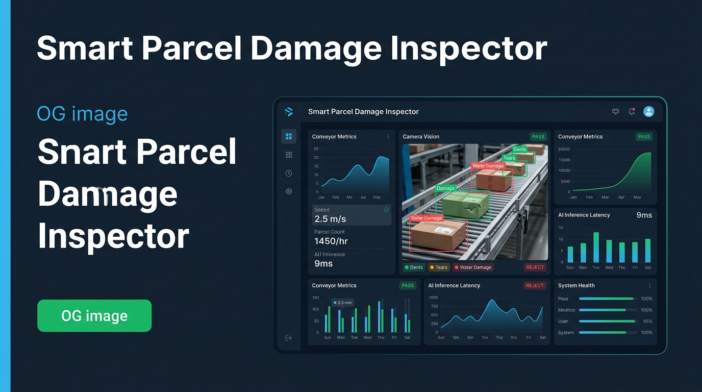
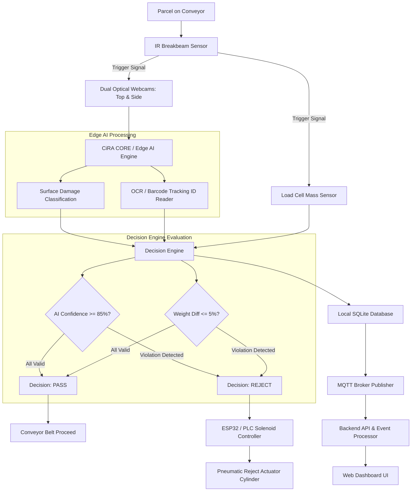
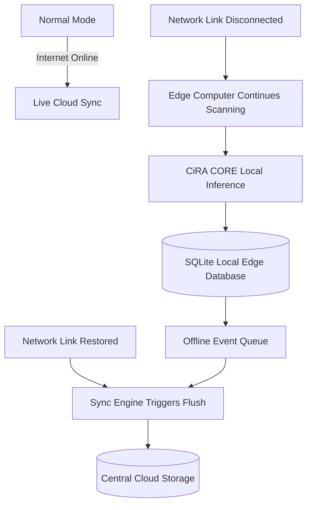
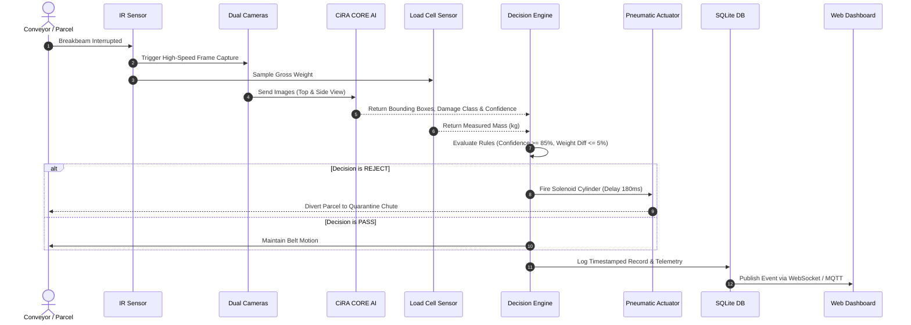
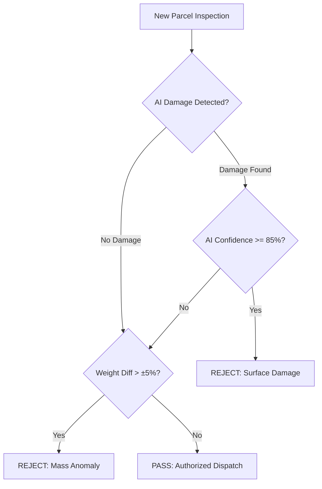
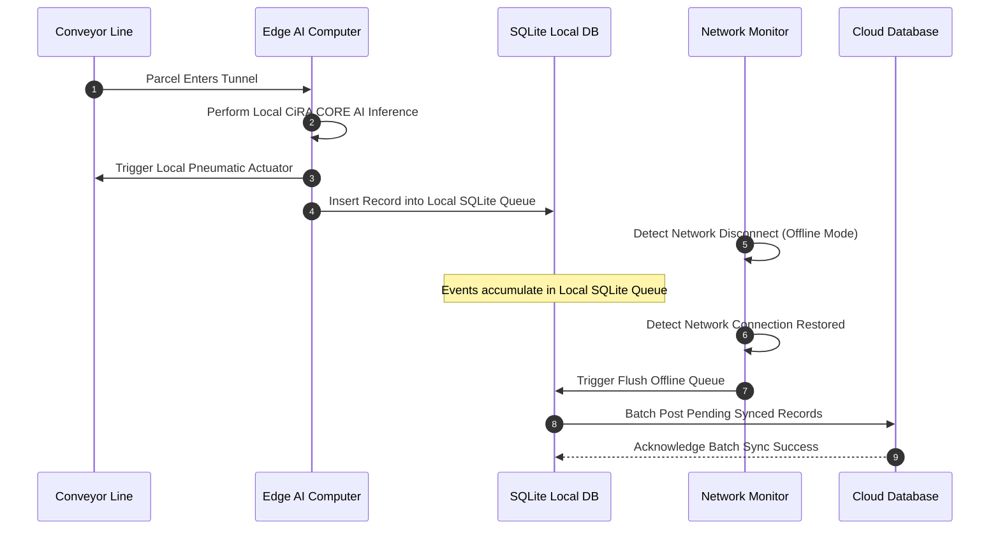

# Smart Parcel Damage Inspector

<p align="center">
  
</p>

<p align="center">
  <strong>Edge AI & IoT Parcel Inspection Dashboard</strong>
</p>

<p align="center">
  <a href="https://ai-parcel-box-damage-detection-system.vercel.app/">
    🌐 Live Demo
  </a>
</p>

<p align="center">
  <a href="https://github.com/satetapongsa/AI-Parcel-Box-Damage-Detection-System"></a>
  <a href="https://ai-parcel-box-damage-detection-system.vercel.app/"></a>
  <a href="https://www.typescriptlang.org/"></a>
  <a href="https://react.dev/"></a>
  <a href="https://tailwindcss.com/"></a>
  <a href="https://ciracore.com/"></a>
</p>

An industrial-grade Edge AI and IoT monitoring platform for real-time parcel integrity verification, machine vision defect classification, load-cell weight anomaly detection, and automated pneumatic sorting.

* **Deployment:** [Live Production on Vercel](https://ai-parcel-box-damage-detection-system.vercel.app/)
* **Repository:** [GitHub Source Code](https://github.com/satetapongsa/AI-Parcel-Box-Damage-Detection-System)
* **Project Status:** Phase 1 Complete (High-Fidelity Dashboard & Integration Engine Live); Phase 2 Integration-Ready (CiRA CORE MQTT Edge Bridge).

---

## 2. Overview

The **Smart Parcel Damage Inspector & Integrity Sorter (SPDI)** is an enterprise industrial IoT and computer vision monitoring system designed for high-throughput logistics sorting centers and warehouse hubs. 

By combining dual-camera optical inspection, CiRA CORE deep learning inference, IR breakbeam detection, and load-cell mass measurement, the system automatically evaluates parcel box physical integrity prior to outbound dispatch. Damaged items (dents, tears, water stains, weight discrepancies) are instantaneously diverted to a quarantine chute via pneumatic actuators while maintaining full digital evidentiary records.

* **Primary Purpose:** Prevent compromised parcels from entering last-mile delivery networks, mitigating customer claims, return overheads, and merchant disputes.
* **Target Environment:** Logistics distribution hubs, postal sortation facilities, e-commerce fulfillment centers, and industrial manufacturing lines.
* **Target Users:** Logistics hub operators, quality assurance engineers, station supervisors, and dispatch managers.

---

## 3. Problem Statement

In modern high-speed logistics sorting hubs, thousands of parcels traverse conveyor belts hourly. Traditional quality control faces major operational challenges:

1. **Undetected Damaged Parcels:** Crushed boxes, torn tape, open seams, and moisture-damaged packages frequently pass unnoticed on high-speed conveyors.
2. **Slow Manual Inspection:** Human visual inspection is labor-intensive, error-prone, subjective, and slows down overall sorting velocity.
3. **Absence of Photographic Evidence:** When customers receive damaged goods, logistics providers lack timestamped photographic proof to verify whether damage occurred in transit or prior to sorting.
4. **Disputes & Claim Overheads:** Retailers and delivery networks face frequent disputes regarding liability for damaged items due to lack of audit trails.
5. **Lack of Automated Isolation:** Without real-time pneumatic or mechanical sorters, isolating damaged parcels requires manual intervention.

---

## 4. System Objectives

* **Automated Parcel Inspection:** Continuous 24/7 non-contact machine vision scan of box surfaces at speed.
* **Multi-Class Damage Detection:** Identify box dents, cardboard collapse, tape tears, open seams, and liquid stains using CiRA CORE AI.
* **Optical Character Recognition (OCR) / Barcode Scanning:** Automatic extraction of tracking numbers (`THA-YYYYMMDD-XXXXXX`).
* **Weight Verification:** High-precision load cell sampling (HX711/PLC) compared against expected manifest weight (±5% tolerance).
* **Automated PASS / REJECT Decision Engine:** Deterministic rule evaluation combining AI confidence scores and mass discrepancies.
* **Digital Evidence Capture:** Timestamped dual-angle photo records and telemetry logs stored in SQLite.
* **Automated Pneumatic Sorter Control:** High-speed solenoid cylinder actuation to divert REJECT parcels to quarantine.
* **Real-Time Operations Telemetry:** Web-based control dashboard displaying system health, throughput, OEE, and live feeds.
* **Offline Resiliency:** Store-and-Forward local edge processing that operates seamlessly without active internet.
* **Cloud Synchronization:** Automated queue flush to central cloud analytics once internet connectivity resumes.

---

## 5. System Architecture

### Main Processing Pipeline Architecture



### Store-and-Forward Offline Resiliency Architecture



---

## 6. Data Flow



### Stage Explanations
1. **Parcel Detection:** IR breakbeam sensor registers the arrival of a parcel at the entry portal.
2. **Image Capture:** Trigger signal instructs top and side optical webcams to grab 1080p snapshot frames.
3. **AI Inference:** CiRA CORE deep learning model detects damage bounding boxes and outputs confidence metrics.
4. **OCR / Barcode:** Tracking code (`THA-YYYYMMDD-XXXXXX`) is extracted from box label.
5. **Weight Check:** Strain-gauge load cell samples mass and compares it to expected manifest weight.
6. **Decision Engine:** Evaluates composite rules (AI classification + weight deviation tolerance).
7. **Sorter Action:** PASS allows parcel to proceed; REJECT fires pneumatic cylinder diverter.
8. **Evidence Storage:** Photos, telemetry, and decision results are recorded in local SQLite DB.
9. **Dashboard Update:** Event state is broadcast in real time to operator UI dashboard.

---

## 7. Decision Logic



### Configurable System Parameters

| Parameter Name | Default Value | Range / Options | Description |
| :--- | :--- | :--- | :--- |
| **AI Confidence Threshold** | `85%` | `50% - 99%` | Minimum confidence score required to trigger AI surface REJECT |
| **Weight Tolerance** | `±5%` | `1% - 15%` | Maximum allowable deviation between measured and manifest weight |
| **Actuator Delay Time** | `180 ms` | `50ms - 500ms` | Time delay between IR entry trigger and pneumatic cylinder extension |
| **Conveyor Velocity** | `0.75 m/s` | `0.1m/s - 2.0m/s` | Calibrated belt speed for timing solenoid firing position |
| **Camera Exposure** | `450 µs` | `100µs - 1000µs` | Shutter exposure setting to prevent motion blur on fast belt |
| **Offline Queue Limit** | `500 records` | `100 - 5000` | Max local event buffer capacity prior to cloud sync flush |

---

## 8. Technology Stack

| Component / Layer | Technology | Version | Implementation Status |
| :--- | :--- | :--- | :--- |
| **Frontend Framework** | React | `19.2` | Implemented |
| **Build System / Tooling** | Vite | `8.3` | Implemented |
| **Language** | TypeScript | `6.0` | Implemented |
| **Styling & Design System** | Vanilla CSS + Tailwind CSS | `4.3` | Implemented |
| **Data Visualization** | Recharts | `3.10` | Implemented |
| **Icons & UI Symbols** | Lucide React | `1.49` | Implemented |
| **Cloud Hosting** | Vercel | Production | Implemented |
| **AI Inference Engine** | CiRA CORE (YOLOv8 / TensorRT) | v2.4 | Planned / Integration-Ready |
| **Microcontroller / PLC** | ESP32 / Industrial PLC | Firmware v1.2 | Planned / Integration-Ready |
| **Messaging Protocol** | MQTT Broker (Mosquitto) | OASIS v3.1.1 | Planned / Integration-Ready |
| **Local Storage** | SQLite Edge Database | v3.45 | Planned / Integration-Ready |
| **Realtime Telemetry** | WebSocket / Server-Sent Events | W3C Standard | Planned / Integration-Ready |

---

## 9. Web Application Structure & Pages

The SPDI web interface provides an enterprise control center across 8 major functional views:

* **Overview Page (`OverviewPage.tsx`):** Central operations center displaying 6 high-level KPIs (Inspected Count, PASS Rate, REJECT Rate, Inspection Velocity, Damaged Count, AI Confidence), live camera preview, hardware status grid, and real-time event sequence log.
* **Live Inspection Page (`LiveInspectionPage.tsx`):** Real-time machine vision inspection view with dual camera feeds (Top & Side), sequential 8-step pipeline status indicator, active scan parameters, and manual trigger controls.
* **Evidence Management Page (`EvidencePage.tsx`):** Searchable QA audit portal enabling operators to filter past scans by Tracking ID, Damage Class (DENT, TEAR, WATER_STAIN, WEIGHT_ANOMALY), or Decision Status. Features full evidentiary detail inspection modal and report export.
* **Analytics Page (`AnalyticsPage.tsx`):** Quality intelligence suite featuring OEE metrics scorecards (Availability, Performance, Quality, Overall OEE Score), PASS vs. REJECT volume donut chart, defect distribution, hourly reject rate line graph, and Pareto root-cause chart.
* **System Health Page (`SystemHealthPage.tsx`):** Hardware topology graph showing compute nodes, camera links, sensors, load cells, PLCs, and MQTT broker latencies, alongside an anomaly incident log.
* **Failure Tests Page (`FailureTestsPage.tsx`):** Boundary condition validation lab for executing automated test scenarios (False Positive Test, AI Confusion Test, Hardware Limit Test, Offline Resiliency Test).
* **Settings Page (`SettingsPage.tsx`):** Parameter configuration interface for tuning AI thresholds, weight tolerances, actuator delays, conveyor speeds, and camera exposures.
* **Architecture Page (`ArchitecturePage.tsx`):** Technical documentation view displaying the complete end-to-end integration diagram, MQTT topic structure, and node specifications.

---

## 10. Real-Time Integration & Edge Bridge

The frontend application features an abstraction layer (`EdgeBridge.ts`) designed to seamlessly transition between simulated frontend events and real Edge AI feeds from CiRA CORE.

```text
CiRA CORE (Edge PC)
       ↓
  Edge Bridge Service
       ↓
   MQTT Broker
       ↓
Backend API / Event Processor
       ↓
SQLite Local Database
       ↓
WebSocket / SSE Stream
       ↓
React Web Dashboard
```

### Normalized Inspection Event Schema (`src/types/spdi.ts`)

```typescript
export interface ParcelRecord {
  id: string;
  trackingNumber: string;
  timestamp: string;
  time: string;
  status: 'PASS' | 'REJECT';
  damageType: 'NORMAL' | 'DENT' | 'TEAR' | 'WATER_STAIN' | 'WEIGHT_ANOMALY';
  aiConfidence: number;
  weight: number;
  expectedWeight: number;
  weightDifference: number;
  actuatorTriggered: boolean;
  rejectReason?: string;
  stationId: string;
  syncedToCloud: boolean;
  topCameraImage?: string;
  sideCameraImage?: string;
  boundingBoxes?: Array<{
    x: number;
    y: number;
    width: number;
    height: number;
    label: string;
    confidence: number;
  }>;
}
```

---

## 11. MQTT Topic Specification

The system uses standardized MQTT topic paths for hardware-to-cloud telemetry:

```text
spdi/
├── {stationId}/
│   ├── inspection     # Inspection decision events & photo metadata
│   ├── alerts         # Critical hardware fault & anomaly alerts
│   ├── sensors        # Real-time sensor telemetry (IR, Load Cell, Speed)
│   ├── actuator       # Pneumatic cylinder firing state & pressure
│   └── system         # Edge health, CPU temp, RAM, and connection state
```

* **`spdi/SORT-01/inspection`**: Published by Edge Bridge upon every completed parcel scan payload.
* **`spdi/SORT-01/alerts`**: Instantaneous alert stream for sensor blockages or low air pressure.
* **`spdi/SORT-01/sensors`**: High-frequency sampling telemetry for load cell and belt tachometers.
* **`spdi/SORT-01/actuator`**: Log of pneumatic solenoid state transitions and stroke confirmation.
* **`spdi/SORT-01/system`**: Heartbeat messages broadcast every 5 seconds.

---

## 12. Offline Mode & Store-and-Forward Architecture

In industrial environments, internet connection drops must not halt the physical conveyor sorting line.



---

## 13. Failure Cases & Diagnostics

### Validation Test Scenarios (`FailureTestsPage.tsx`)
1. **False Positive Test:** Verifies that minor printed box graphics or shipping labels are not misclassified as box surface tears or punctures.
2. **AI Confusion Test:** Evaluates edge cases where water stains overlap with crushed cardboard boundaries to ensure correct multi-label classification.
3. **Hardware Limit Test:** Evaluates system behavior under high conveyor velocity (1.8 m/s) to confirm pneumatic solenoid timing accuracy.
4. **Offline Resiliency Test:** Simulates total WAN disconnect during continuous 100-parcel sorting to confirm zero data loss in local SQLite queue.

### Hardware Fault Scenarios
* **Camera Vision Fault:** Loss of optical feed triggers warning tower light and pauses conveyor.
* **IR Sensor Jam:** Continuous beam break (> 5 seconds) flags conveyor blockage anomaly.
* **Actuator Air Loss:** Pneumatic pressure drop below 4.0 bar halts dispatch and notifies operator.
* **Network Interruption:** Automatic failover to local Store-and-Forward mode.

---

## 14. Project Structure

```text
ai-parcel-box-inspection/
├── .github/                  # GitHub workflows & CI configuration
├── public/                   # Static assets & public resources
│   └── logo.svg              # Official SPDI System Logo
├── src/                      # Source code
│   ├── assets/               # Local static image assets
│   ├── components/           # Reusable UI component library
│   │   ├── common/           # Standardized design system components
│   │   │   ├── MetricCard.tsx  # Standardized KPI display card
│   │   │   ├── Modal.tsx       # Viewport-bounded modal overlay
│   │   │   ├── PageHeader.tsx  # Standardized page title header
│   │   │   ├── SectionCard.tsx # Container card with header slots
│   │   │   └── StatusBadge.tsx # PASS / REJECT / Status badges
│   │   ├── Header.tsx        # Top navigation header & telemetry bar
│   │   ├── InspectionVisualizer.tsx # Dual camera feed overlay
│   │   ├── NotificationDrawer.tsx   # System notification drawer
│   │   ├── ParcelVisualizer.tsx     # 3D/2D parcel box preview
│   │   ├── Sidebar.tsx       # Desktop & mobile responsive sidebar
│   │   └── Toast.tsx         # Real-time alert notifications
│   ├── context/              # Global state management
│   │   └── SimulationContext.tsx # Central store & mock simulation engine
│   ├── data/                 # Static mock data & initial state
│   │   └── mockData.ts       # Architecture nodes, KPIs & test cases
│   ├── lib/                  # Utilities & edge integration layer
│   │   └── edgeBridge.ts     # Edge Bridge abstraction layer
│   ├── pages/                # Page route views
│   │   ├── AnalyticsPage.tsx # Industrial quality analytics
│   │   ├── ArchitecturePage.tsx # System topology & pipeline
│   │   ├── EvidencePage.tsx  # Evidence management & claim QA
│   │   ├── FailureTestsPage.tsx # Validation lab & failure tests
│   │   ├── LiveInspectionPage.tsx # Machine vision inspection view
│   │   ├── OverviewPage.tsx  # Operations control dashboard
│   │   ├── SettingsPage.tsx  # Parameter configuration view
│   │   └── SystemHealthPage.tsx # Hardware health & bus telemetry
│   ├── types/                # TypeScript interface definitions
│   │   └── spdi.ts           # Central data types & records
│   ├── App.css               # App-level styling rules
│   ├── App.tsx               # Main application component & layout shell
│   ├── index.css             # Design tokens & global CSS utilities
│   └── main.tsx              # Application entry point
├── .gitignore                # Git ignore rules
├── .oxlintrc.json            # Linter configuration
├── index.html                # HTML document template
├── package.json              # Project dependencies & scripts
├── tsconfig.app.json         # TypeScript application config
├── tsconfig.json             # Root TypeScript config
├── tsconfig.node.json        # TypeScript Node config
└── vite.config.ts            # Vite bundler configuration
```

---

## 15. Installation & Setup

### Prerequisites
* **Node.js:** v18.0.0 or higher
* **npm:** v9.0.0 or higher

### Steps

1. **Clone the Repository:**
   ```bash
   git clone https://github.com/satetapongsa/AI-Parcel-Box-Damage-Detection-System.git
   cd ai-parcel-box-inspection
   ```

2. **Install Dependencies:**
   ```bash
   npm install
   ```

3. **Launch Local Development Server:**
   ```bash
   npm run dev
   ```
   Open your browser at `http://localhost:5173/`.

4. **Execute Production Build:**
   ```bash
   npm run build
   ```

---

## 16. Environment Variables

Create a `.env` file in the project root for custom configuration:

```env
# Required for Live Edge Integration (Planned)
VITE_EDGE_BRIDGE_URL=http://localhost:5000
VITE_MQTT_BROKER_URL=ws://localhost:9001
VITE_STATION_ID=SORT-01

# Optional Application Options
VITE_DEMO_AUTO_START=true
VITE_LOG_LEVEL=info
```

---

## 17. Development Scripts

All available package scripts verified from `package.json`:

* `npm run dev`: Starts the local Vite development server with hot module replacement (HMR).
* `npm run build`: Compiles TypeScript types (`tsc -b`) and bundles production assets via Vite.
* `npm run lint`: Executes `oxlint` for high-performance JavaScript/TypeScript linting.
* `npm run preview`: Bootstraps a local static web server to preview the built `dist/` directory.

---

## 18. Deployment

The web dashboard is configured for continuous deployment on **Vercel**.

```text
GitHub (main branch) ──> Vercel CI/CD Build ──> Production Edge Network
```

> **Note on Architecture:** Vercel hosts the web application dashboard and monitoring user interface. Physical hardware control (solenoid actuators, IR sensors, load cells) and real-time vision inference execute locally on the Edge PC (CiRA CORE) within the warehouse facility network.

---

## 19. Security & Data Integrity

* **Environment Variable Protection:** API credentials and broker links are injected via `VITE_` prefixed environment variables.
* **Input Validation:** Strict TypeScript schemas validate all incoming WebSocket/MQTT inspection payloads.
* **Local/Cloud Air-Gap Separation:** The local inspection line operates independently from cloud availability, ensuring hardware safety.
* **Read-Only Operator Access:** Sorter manual controls require authenticated role credentials in production setups.

---

## 20. Development Roadmap

* [x] **Phase 1: High-Fidelity UI/UX & Simulation Dashboard (Completed)**
  * Enterprise design tokens, responsive layout shell, zero text collision, and full simulation engine.
* [ ] **Phase 2: CiRA CORE & Edge Bridge Integration**
  * Direct MQTT payload ingestion from CiRA CORE Vision Engine.
* [ ] **Phase 3: Hardware Sensor & PLC Protocol Coupling**
  * Modbus TCP / ESP32 integration for load cells and pneumatic solenoids.
* [ ] **Phase 4: Store-and-Forward SQLite Synchronization Engine**
  * Automated queue flush & background synchronization service.
* [ ] **Phase 5: On-Site Hardware Deployment**
  * Physical conveyor inspection tunnel deployment at test logistics hub.

---

## 21. Team Members

**Sripatum University (SPU)**  
*Capstone Project Engineering Team (Sec002)*

| Student ID | Student Name | Role / Focus Area | Section |
| :--- | :--- | :--- | :--- |
| **66013507** | วชิระ เฟื้อแก้ว (*Wachira Fueakaew*) | CiRA CORE Deep Learning & Computer Vision | Sec002 |
| **66088911** | เศรษฐพงศ์ สงวนสุข (*Satetapongsa Sanguansook*) | FullStack Architecture & UI/UX Systems | Sec002 |
| **66039252** | นนทพัทธ์ จีนเกิด (*Nontapat Jeengeard*) | Hardware & Microcontroller Integration | Sec002 |
| **66027138** | ณัฐวัฒน์ ปราณวรกิจ (*Nattawat Pranworakit*) | IoT Network, MQTT Telemetry | Sec002 |

